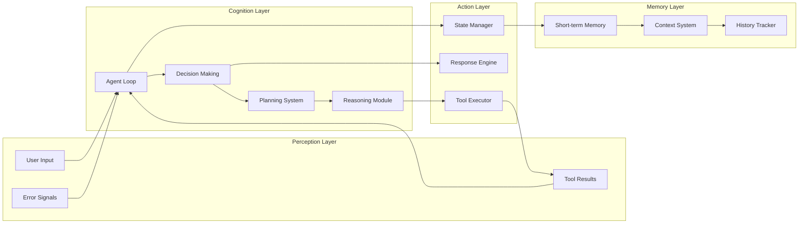
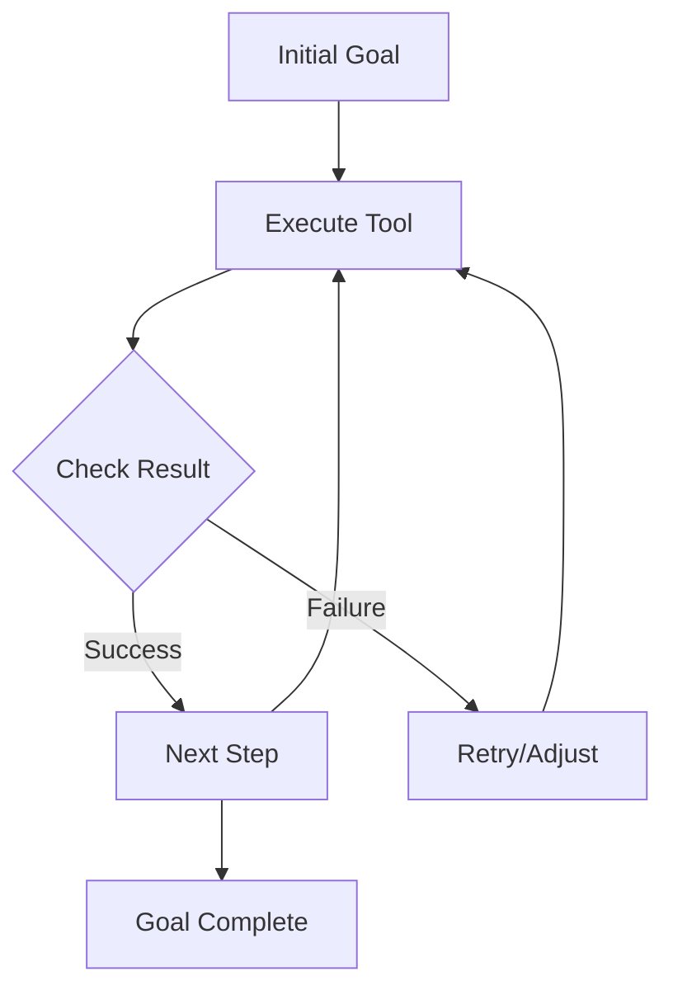
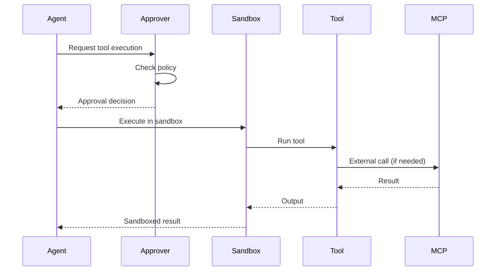

# Agentic AI Framework Deep Dive

This document provides an in-depth analysis of Codex's agentic AI architecture, examining how it achieves autonomous behavior, intelligent decision-making, and robust task execution.

## What Makes Codex "Agentic"?

An agentic AI system exhibits several key characteristics that Codex implements:

1. **Autonomy**: Operates independently toward goals
2. **Persistence**: Continues working until task completion
3. **Adaptability**: Adjusts strategies based on feedback
4. **Tool Use**: Leverages external capabilities
5. **Memory**: Maintains context across interactions
6. **Error Recovery**: Handles failures gracefully

## Core Agent Architecture



## The Agent Loop: Heart of Autonomy

The agent loop in `/codex-cli/src/utils/agent/agent-loop.ts` implements the core autonomous behavior:

```typescript
class AgentLoop {
  async *run(prompt: string): AsyncGenerator<AgentEvent> {
    // Initialize conversation
    const turnInput = [{ type: 'text', text: prompt }];
    
    // AUTONOMOUS EXECUTION LOOP
    while (turnInput.length > 0) {
      // 1. Perception: Gather input
      const messages = this.buildMessages(turnInput);
      
      // 2. Cognition: Request LLM decision
      const stream = await this.llmClient.chatCompletions({
        model: this.model,
        messages,
        tools: this.tools,
        reasoning: this.reasoningConfig
      });
      
      // 3. Action: Execute decisions
      for await (const chunk of stream) {
        if (chunk.type === 'function_call') {
          // Execute tool and gather results
          const result = await this.executeTool(chunk);
          turnInput.push(result); // Feedback loop
        }
      }
      
      // 4. Evaluation: Check if task is complete
      turnInput = this.filterNewInputs(turnInput);
    }
  }
}
```

### Key Autonomous Behaviors

1. **Continuous Operation**: The `while` loop continues until no new inputs
2. **Feedback Integration**: Tool results become new inputs
3. **State Persistence**: Maintains conversation context
4. **Error Resilience**: Continues despite individual failures

## Decision-Making Architecture

### 1. Goal-Directed Behavior

The system prompt explicitly instructs goal-oriented behavior:

```markdown
You are an AI assistant focused on one thing: achieving the user's goal...
Keep going until the user's query is completely resolved.
```

### 2. Tool Selection Logic

The agent makes intelligent tool choices:

```typescript
// Tool availability communicated to LLM
const tools = [
  {
    type: 'function',
    function: {
      name: 'shell',
      description: 'Execute shell commands to accomplish tasks',
      parameters: {
        type: 'object',
        properties: {
          command: { 
            type: 'string',
            description: 'The command to execute'
          }
        }
      }
    }
  },
  // ... other tools
];
```

### 3. Reasoning Integration

For advanced models, reasoning is explicitly enabled:

```typescript
if (this.model.startsWith("o") || this.model.startsWith("codex")) {
  reasoning = {
    effort: this.config.reasoningEffort ?? "high",
    summary: "auto"
  };
}
```

## Planning and Task Decomposition

While Codex doesn't implement explicit planning algorithms, it achieves planning through:

### 1. Prompt-Guided Decomposition

The system prompt encourages step-by-step thinking:
- "Think step by step"
- "Break down complex tasks"
- "Execute incrementally"

### 2. Iterative Refinement

Each tool execution provides feedback for the next step:



### 3. Context-Aware Planning

The agent considers:
- Current directory structure
- Available tools
- Previous execution results
- User preferences (AGENTS.md)

## Memory and State Management

### Short-Term Memory (Working Memory)

Maintained within a single session:

```typescript
class AgentLoop {
  private transcript: Message[] = [];
  private pendingAborts = new Set<string>();
  private cancelController?: CancelController;
  
  // Working memory for current task
  private currentToolCalls: ToolCall[] = [];
  private executionContext: ExecutionContext = {};
}
```

### Long-Term Memory (Conversation History)

Persisted across sessions:

```typescript
interface HistoryEntry {
  session_id: string;
  timestamp: string;
  text: string;
}

// Stored in ~/.codex/history.jsonl
```

### Contextual Memory (AGENTS.md)

Project-specific knowledge:
- Coding standards
- Project structure
- Domain knowledge
- Custom instructions

## Adaptive Behavior Mechanisms

### 1. Error Adaptation

The agent adapts to errors through:

```typescript
async executeTool(toolCall: ToolCall): Promise<ToolResult> {
  try {
    const result = await this.toolExecutor.execute(toolCall);
    return { success: true, output: result };
  } catch (error) {
    // Adapt by providing error context
    return {
      success: false,
      output: `Error: ${error.message}`,
      // Agent can try alternative approaches
    };
  }
}
```

### 2. Approval Learning

The system caches user decisions:

```typescript
if (response === 'always') {
  this.alwaysApproveCache.add(command);
  // Future similar commands auto-approved
}
```

### 3. Model-Specific Adaptation

Different behaviors for different models:
- Reasoning models: Extended thinking time
- Code models: Specialized prompts
- Chat models: Conversational style

## Tool Use and External Integration

### Tool Execution Pipeline



### Tool Categories

1. **Execution Tools**: Shell commands, scripts
2. **Modification Tools**: Apply-patch for code changes
3. **Integration Tools**: MCP for external services
4. **Information Tools**: File search, content grep

## Robustness and Reliability

### 1. Retry Mechanisms

```typescript
async retryWithBackoff<T>(
  operation: () => Promise<T>,
  maxAttempts: number = 8
): Promise<T> {
  for (let attempt = 0; attempt < maxAttempts; attempt++) {
    try {
      return await operation();
    } catch (error) {
      if (!this.isRetryable(error) || attempt === maxAttempts - 1) {
        throw error;
      }
      await this.delay(Math.pow(2, attempt) * 1000);
    }
  }
}
```

### 2. Graceful Degradation

- Partial results on stream failure
- Fallback to cached responses
- Alternative tool strategies

### 3. State Recovery

- Pending operations tracked
- Synthetic outputs for cancelled operations
- Context preservation on errors

## Emergent Agentic Properties

### 1. Goal Persistence

The agent exhibits determination through:
- Retry on failure
- Alternative approaches
- Incremental progress

### 2. Creative Problem Solving

Emerges from:
- Flexible tool use
- Context integration
- Model capabilities

### 3. Learning-like Behavior

Through:
- Approval caching
- Error feedback
- Context accumulation

## Design Patterns for Agentic AI

### 1. The Perception-Action Loop

```typescript
interface AgentCycle {
  perceive(): Input[];
  decide(inputs: Input[]): Action[];
  execute(actions: Action[]): Result[];
  reflect(results: Result[]): void;
}
```

### 2. Tool Abstraction Pattern

```typescript
interface Tool {
  name: string;
  description: string;
  parameters: JSONSchema;
  execute(params: any): Promise<any>;
}
```

### 3. Context Layering Pattern

```typescript
class ContextManager {
  layers: ContextLayer[] = [
    SystemContext,
    UserContext,
    ProjectContext,
    SessionContext
  ];
  
  build(): string {
    return this.layers
      .map(layer => layer.content)
      .filter(Boolean)
      .join('\n');
  }
}
```

## Key Insights for Building Agentic AI

1. **Autonomy through Loops**: The while loop is the foundation of autonomous behavior
2. **Tools Enable Agency**: External capabilities expand what the agent can achieve
3. **Context is Crucial**: Rich context enables better decision-making
4. **Errors are Information**: Failed attempts guide future actions
5. **Safety Requires Layers**: Multiple approval and sandboxing layers ensure safety
6. **Streaming Enables Interactivity**: Real-time feedback improves user experience
7. **Simplicity Scales**: Simple patterns (loop + tools) create complex behaviors

This framework demonstrates that sophisticated agentic behavior emerges from well-designed simple components working together in a robust architecture.