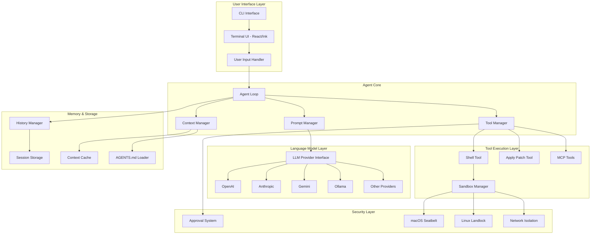
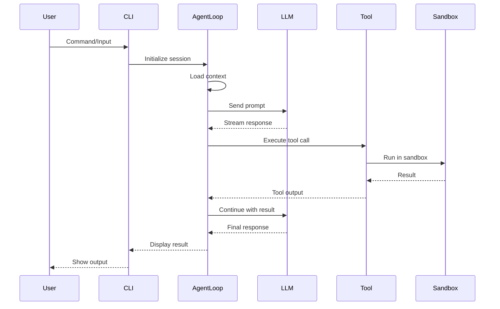

# Architecture Overview

Codex is a sophisticated agentic AI system built as a monorepo with TypeScript and Rust components. This document provides a comprehensive overview of the system architecture.

## System Architecture Diagram



## Component Architecture

### 1. Frontend Layer (TypeScript)

**Location**: `/codex-cli/`

The frontend is built with modern TypeScript and React technologies:

- **CLI Entry Point** (`src/cli.tsx`): Main command-line interface using commander.js
- **Terminal UI** (`src/ui/`): React-based TUI using Ink framework
  - Real-time streaming responses
  - Interactive approval flows
  - Syntax highlighting with Shiki
  - File tag suggestions

**Key Components**:
```
codex-cli/
├── src/
│   ├── cli.tsx                 # Main CLI entry point
│   ├── ui/                     # React/Ink UI components
│   │   ├── app.tsx            # Main app component
│   │   ├── message.tsx        # Message rendering
│   │   └── input.tsx          # User input handling
│   └── utils/
│       ├── agent/             # Agent logic
│       │   └── agent-loop.ts  # Core agent loop
│       ├── tool-executor.ts   # Tool execution
│       └── llm/              # LLM integrations
```

### 2. Backend Layer (Rust)

**Location**: `/codex-rs/`

The Rust backend provides performance-critical components:

- **Core Library** (`core/`): Agent implementation and prompt management
- **Sandbox** (`sandbox/`): Platform-specific sandboxing
- **File Search** (`file-search/`): Fast fuzzy file matching
- **CLI** (`cli/`): Rust CLI implementation

**Key Components**:
```
codex-rs/
├── core/                      # Core agent logic
│   ├── agent.rs              # Agent implementation
│   ├── openai_api.rs         # API client
│   └── prompt.md             # System prompt
├── sandbox/                   # Sandboxing
│   ├── macos.rs              # macOS Seatbelt
│   └── linux.rs              # Linux Landlock
└── file-search/              # File search engine
```

### 3. Communication Architecture

The system uses multiple communication patterns:

1. **Process Spawning**: TypeScript spawns Rust processes for performance-critical operations
2. **Protocol Buffers**: Structured data exchange between components
3. **Server-Sent Events**: Streaming responses from LLM providers
4. **JSON-RPC**: MCP tool communication

### 4. Data Flow



## Key Design Decisions

### 1. Monorepo Structure

- **Shared types**: Common interfaces between TypeScript and Rust
- **Unified tooling**: Consistent build and test processes
- **Atomic changes**: Features span both implementations

### 2. Language Choice Rationale

**TypeScript Frontend**:
- Rich ecosystem for CLI tools (commander, ink, chalk)
- Excellent async/streaming support
- Familiar to web developers

**Rust Backend**:
- Performance for file operations
- Memory safety for sandboxing
- Low-level system access

### 3. Streaming-First Architecture

- All LLM interactions use streaming
- Real-time user feedback
- Cancellable operations
- Lower perceived latency

### 4. Security by Design

- Default sandboxing for all operations
- Progressive approval system
- Network isolation in full-auto mode
- No persistent permissions

## Extension Points

### 1. LLM Providers

New providers implement the `LLMClient` interface:
```typescript
interface LLMClient {
  chatCompletions(options: ChatCompletionOptions): AsyncIterable<ChatCompletionChunk>
}
```

### 2. Tools

Tools can be added through:
- Built-in tools in `agent-loop.ts`
- MCP servers for external tools
- Custom tool implementations

### 3. Sandboxing

Platform-specific sandboxing through:
- Policy files (macOS `.sb` files)
- Capability systems (Linux Landlock)
- Container integration (Docker)

## Performance Characteristics

### Startup Time
- TypeScript CLI: ~200ms
- Rust CLI: ~10ms
- First LLM call: +500-2000ms

### Memory Usage
- Base: ~50MB
- With conversation: +10MB per 100 messages
- File search index: +1MB per 10k files

### Concurrency
- Parallel tool execution
- Async I/O throughout
- Thread-safe history management

## Deployment Architecture

### Development
```bash
npm run dev          # TypeScript development
cargo run           # Rust development
```

### Production
```bash
npm run build       # Build TypeScript
cargo build --release # Build Rust
```

### Distribution
- npm package for Node.js users
- Homebrew formula for macOS
- Binary releases for all platforms

This architecture provides a solid foundation for building sophisticated agentic AI applications with a focus on performance, security, and extensibility.