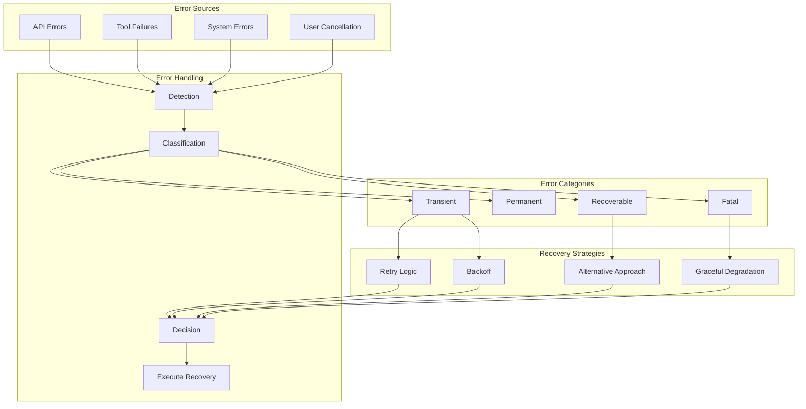

# Error Handling and Recovery Strategies

This document details the comprehensive error handling and recovery mechanisms in Codex, providing patterns and best practices for building resilient agentic AI systems.

## Error Handling Architecture



## Error Classification System

### 1. Error Categories

```typescript
enum ErrorCategory {
  // Temporary issues that may resolve
  TRANSIENT = 'transient',
  
  // Permanent failures requiring intervention
  PERMANENT = 'permanent',
  
  // Errors that can be worked around
  RECOVERABLE = 'recoverable',
  
  // Unrecoverable system failures
  FATAL = 'fatal'
}

interface ClassifiedError {
  category: ErrorCategory;
  original: Error;
  retryable: boolean;
  alternativeApproach?: string;
  userMessage: string;
}
```

### 2. Error Classifier Implementation

```typescript
class ErrorClassifier {
  classify(error: Error): ClassifiedError {
    // Network errors - usually transient
    if (this.isNetworkError(error)) {
      return {
        category: ErrorCategory.TRANSIENT,
        original: error,
        retryable: true,
        userMessage: "Network issue detected, will retry..."
      };
    }
    
    // Rate limits - transient with backoff
    if (this.isRateLimit(error)) {
      return {
        category: ErrorCategory.TRANSIENT,
        original: error,
        retryable: true,
        userMessage: "Rate limit hit, waiting before retry..."
      };
    }
    
    // Permission errors - recoverable
    if (this.isPermissionError(error)) {
      return {
        category: ErrorCategory.RECOVERABLE,
        original: error,
        retryable: false,
        alternativeApproach: "Try with elevated permissions or different path",
        userMessage: "Permission denied, trying alternative approach..."
      };
    }
    
    // File not found - recoverable
    if (this.isFileNotFound(error)) {
      return {
        category: ErrorCategory.RECOVERABLE,
        original: error,
        retryable: false,
        alternativeApproach: "Create file or check path",
        userMessage: "File not found, will create or find alternative..."
      };
    }
    
    // Out of memory - fatal
    if (this.isOutOfMemory(error)) {
      return {
        category: ErrorCategory.FATAL,
        original: error,
        retryable: false,
        userMessage: "System out of memory, cannot continue"
      };
    }
    
    // Default - permanent
    return {
      category: ErrorCategory.PERMANENT,
      original: error,
      retryable: false,
      userMessage: `Error: ${error.message}`
    };
  }
  
  private isNetworkError(error: Error): boolean {
    const networkCodes = ['ECONNRESET', 'ETIMEDOUT', 'ENOTFOUND', 'ECONNREFUSED'];
    return networkCodes.includes((error as any).code);
  }
  
  private isRateLimit(error: Error): boolean {
    return (error as any).status === 429 || 
           error.message.includes('rate limit');
  }
}
```

## Retry Strategies

### 1. Exponential Backoff with Jitter

```typescript
class RetryManager {
  async retryWithBackoff<T>(
    operation: () => Promise<T>,
    options: RetryOptions = {}
  ): Promise<T> {
    const {
      maxAttempts = 5,
      initialDelay = 1000,
      maxDelay = 30000,
      factor = 2,
      jitter = true
    } = options;
    
    let lastError: Error;
    
    for (let attempt = 0; attempt < maxAttempts; attempt++) {
      try {
        return await operation();
      } catch (error) {
        lastError = error;
        
        // Check if retryable
        const classified = this.classifier.classify(error);
        if (!classified.retryable) {
          throw error;
        }
        
        // Calculate delay
        let delay = Math.min(
          initialDelay * Math.pow(factor, attempt),
          maxDelay
        );
        
        // Add jitter to prevent thundering herd
        if (jitter) {
          delay = delay * (0.5 + Math.random() * 0.5);
        }
        
        // Special handling for rate limits
        if (error.headers?.['retry-after']) {
          delay = parseInt(error.headers['retry-after']) * 1000;
        }
        
        console.log(`Attempt ${attempt + 1} failed, retrying in ${delay}ms...`);
        await this.sleep(delay);
      }
    }
    
    throw new Error(`Failed after ${maxAttempts} attempts: ${lastError.message}`);
  }
  
  private sleep(ms: number): Promise<void> {
    return new Promise(resolve => setTimeout(resolve, ms));
  }
}
```

### 2. Circuit Breaker Pattern

```typescript
class CircuitBreaker {
  private failures = 0;
  private lastFailureTime = 0;
  private state: 'closed' | 'open' | 'half-open' = 'closed';
  
  constructor(
    private threshold = 5,
    private timeout = 60000  // 1 minute
  ) {}
  
  async execute<T>(operation: () => Promise<T>): Promise<T> {
    if (this.state === 'open') {
      if (Date.now() - this.lastFailureTime > this.timeout) {
        this.state = 'half-open';
      } else {
        throw new Error('Circuit breaker is open');
      }
    }
    
    try {
      const result = await operation();
      this.onSuccess();
      return result;
    } catch (error) {
      this.onFailure();
      throw error;
    }
  }
  
  private onSuccess() {
    this.failures = 0;
    this.state = 'closed';
  }
  
  private onFailure() {
    this.failures++;
    this.lastFailureTime = Date.now();
    
    if (this.failures >= this.threshold) {
      this.state = 'open';
      console.log('Circuit breaker opened due to repeated failures');
    }
  }
}
```

## Tool Execution Error Handling

### 1. Tool Failure Recovery

```typescript
class ToolExecutor {
  async executeWithRecovery(
    tool: string,
    params: any
  ): Promise<ToolResult> {
    try {
      return await this.execute(tool, params);
    } catch (error) {
      const recovery = this.getRecoveryStrategy(tool, error);
      
      switch (recovery.type) {
        case 'retry':
          return await this.retryExecution(tool, params, recovery.options);
          
        case 'fallback':
          return await this.executeFallback(recovery.fallbackTool, params);
          
        case 'repair':
          await this.repairAndRetry(tool, params, error);
          return await this.execute(tool, params);
          
        case 'skip':
          return {
            status: 'skipped',
            reason: recovery.reason,
            error: error.message
          };
          
        default:
          throw error;
      }
    }
  }
  
  private getRecoveryStrategy(tool: string, error: Error): RecoveryStrategy {
    // Tool-specific recovery strategies
    const strategies = {
      'shell': {
        'EACCES': { type: 'repair', action: 'chmod +x' },
        'ENOENT': { type: 'fallback', fallbackTool: 'shell_alt' },
        'ETIMEDOUT': { type: 'retry', options: { maxAttempts: 3 } }
      },
      'file_read': {
        'ENOENT': { type: 'skip', reason: 'File does not exist' },
        'EACCES': { type: 'repair', action: 'check_permissions' }
      }
    };
    
    return strategies[tool]?.[error.code] || { type: 'throw' };
  }
}
```

### 2. Cascading Fallbacks

```typescript
class FallbackChain {
  private chains = new Map<string, string[]>([
    ['npm', ['npm', 'yarn', 'pnpm']],
    ['python', ['python3', 'python', 'py']],
    ['make', ['make', 'gmake', 'nmake']]
  ]);
  
  async executeWithFallbacks(
    command: string,
    args: string[]
  ): Promise<ExecutionResult> {
    const [cmd, ...cmdArgs] = command.split(' ');
    const fallbacks = this.chains.get(cmd) || [cmd];
    
    let lastError: Error;
    
    for (const fallbackCmd of fallbacks) {
      try {
        return await this.execute(fallbackCmd, [...cmdArgs, ...args]);
      } catch (error) {
        lastError = error;
        console.log(`${fallbackCmd} failed, trying next...`);
      }
    }
    
    throw new Error(
      `All fallbacks failed. Last error: ${lastError.message}`
    );
  }
}
```

## API Error Handling

### 1. Streaming Error Recovery

```typescript
class StreamingClient {
  async *streamWithRecovery(
    request: Request
  ): AsyncGenerator<Chunk> {
    let attempt = 0;
    let lastCheckpoint: string | null = null;
    
    while (attempt < this.maxAttempts) {
      try {
        const stream = await this.createStream(request);
        
        for await (const chunk of stream) {
          yield chunk;
          
          // Save checkpoint for recovery
          if (chunk.type === 'checkpoint') {
            lastCheckpoint = chunk.id;
          }
        }
        
        return; // Success
        
      } catch (error) {
        attempt++;
        
        if (!this.isRecoverable(error)) {
          throw error;
        }
        
        // Resume from checkpoint if available
        if (lastCheckpoint) {
          request.resumeFrom = lastCheckpoint;
          console.log(`Resuming stream from checkpoint: ${lastCheckpoint}`);
        }
        
        await this.backoff(attempt);
      }
    }
    
    throw new Error('Stream failed after maximum attempts');
  }
}
```

### 2. Response Validation and Recovery

```typescript
class ResponseValidator {
  async validateAndRecover(
    response: Response,
    request: Request
  ): Promise<ValidatedResponse> {
    // Check response completeness
    if (!this.isComplete(response)) {
      console.log('Incomplete response detected, requesting continuation...');
      
      const continuation = await this.requestContinuation(
        request,
        response.partial
      );
      
      response = this.mergeResponses(response, continuation);
    }
    
    // Validate response format
    if (!this.isValidFormat(response)) {
      console.log('Invalid format, attempting to repair...');
      
      response = await this.repairFormat(response);
    }
    
    // Check for truncation
    if (this.isTruncated(response)) {
      console.log('Response truncated, fetching remaining content...');
      
      const remaining = await this.fetchRemaining(request, response);
      response = this.appendContent(response, remaining);
    }
    
    return response as ValidatedResponse;
  }
}
```

## State Recovery

### 1. Transaction-like Operations

```typescript
class TransactionalExecutor {
  async executeTransaction(
    operations: Operation[]
  ): Promise<TransactionResult> {
    const completed: CompletedOperation[] = [];
    const rollback: RollbackAction[] = [];
    
    try {
      for (const op of operations) {
        // Create rollback action before execution
        const rollbackAction = await this.createRollback(op);
        rollback.push(rollbackAction);
        
        // Execute operation
        const result = await this.execute(op);
        completed.push({ operation: op, result });
      }
      
      return { status: 'success', completed };
      
    } catch (error) {
      console.log('Transaction failed, rolling back...');
      
      // Rollback in reverse order
      for (const action of rollback.reverse()) {
        try {
          await action.execute();
        } catch (rollbackError) {
          console.error('Rollback failed:', rollbackError);
        }
      }
      
      return {
        status: 'failed',
        completed,
        error,
        rolledBack: true
      };
    }
  }
}
```

### 2. Checkpoint and Resume

```typescript
class CheckpointManager {
  private checkpoints = new Map<string, Checkpoint>();
  
  async executeWithCheckpoints(
    taskId: string,
    steps: Step[]
  ): Promise<void> {
    // Try to resume from checkpoint
    const checkpoint = await this.loadCheckpoint(taskId);
    const startIndex = checkpoint?.lastCompletedStep || 0;
    
    for (let i = startIndex; i < steps.length; i++) {
      try {
        await this.executeStep(steps[i]);
        
        // Save checkpoint after each successful step
        await this.saveCheckpoint(taskId, {
          lastCompletedStep: i,
          timestamp: Date.now(),
          state: steps[i].state
        });
        
      } catch (error) {
        console.log(`Step ${i} failed, checkpoint saved at step ${i - 1}`);
        throw error;
      }
    }
    
    // Clean up checkpoint on success
    await this.deleteCheckpoint(taskId);
  }
}
```

## User Cancellation Handling

### 1. Graceful Cancellation

```typescript
class CancellableOperation {
  private cancelled = false;
  private cleanup: (() => Promise<void>)[] = [];
  
  async execute(
    operation: () => Promise<void>,
    signal: AbortSignal
  ): Promise<void> {
    signal.addEventListener('abort', () => {
      this.cancelled = true;
    });
    
    try {
      await operation();
    } catch (error) {
      if (this.cancelled) {
        await this.performCleanup();
        throw new Error('Operation cancelled by user');
      }
      throw error;
    }
  }
  
  registerCleanup(fn: () => Promise<void>) {
    this.cleanup.push(fn);
  }
  
  private async performCleanup() {
    console.log('Performing cleanup after cancellation...');
    
    for (const cleanupFn of this.cleanup.reverse()) {
      try {
        await cleanupFn();
      } catch (error) {
        console.error('Cleanup error:', error);
      }
    }
  }
}
```

### 2. Partial Result Preservation

```typescript
class PartialResultHandler {
  async executeWithPartialResults<T>(
    items: T[],
    processor: (item: T) => Promise<ProcessedItem>,
    signal: AbortSignal
  ): Promise<PartialResults<T>> {
    const results: ProcessedItem[] = [];
    const errors: Array<{ item: T; error: Error }> = [];
    let cancelled = false;
    
    for (const item of items) {
      if (signal.aborted) {
        cancelled = true;
        break;
      }
      
      try {
        const result = await processor(item);
        results.push(result);
      } catch (error) {
        errors.push({ item, error });
        
        // Decide whether to continue
        if (this.shouldStopOnError(error)) {
          break;
        }
      }
    }
    
    return {
      completed: results,
      failed: errors,
      remaining: items.slice(results.length + errors.length),
      cancelled
    };
  }
}
```

## Error Reporting and Logging

### 1. Structured Error Logging

```typescript
class ErrorLogger {
  logError(error: Error, context: ErrorContext) {
    const errorInfo = {
      timestamp: new Date().toISOString(),
      errorType: error.constructor.name,
      message: error.message,
      stack: error.stack,
      context: {
        operation: context.operation,
        parameters: context.parameters,
        userId: context.userId,
        sessionId: context.sessionId
      },
      classification: this.classifier.classify(error),
      recovery: {
        attempted: context.recoveryAttempted,
        strategy: context.recoveryStrategy,
        success: context.recoverySuccess
      }
    };
    
    // Log to appropriate destination
    if (this.isCritical(error)) {
      this.alerting.sendAlert(errorInfo);
    }
    
    this.logger.error(errorInfo);
  }
}
```

### 2. User-Friendly Error Messages

```typescript
class ErrorFormatter {
  formatForUser(error: ClassifiedError): UserMessage {
    const templates = {
      [ErrorCategory.TRANSIENT]: {
        title: "Temporary Issue",
        message: "We're experiencing a temporary problem. Retrying...",
        icon: "⏳"
      },
      [ErrorCategory.RECOVERABLE]: {
        title: "Working Around Issue",
        message: "Encountered an issue but found an alternative approach.",
        icon: "🔄"
      },
      [ErrorCategory.PERMANENT]: {
        title: "Action Required",
        message: "This operation cannot be completed automatically.",
        icon: "⚠️"
      },
      [ErrorCategory.FATAL]: {
        title: "Critical Error",
        message: "A serious error occurred. Please restart and try again.",
        icon: "❌"
      }
    };
    
    const template = templates[error.category];
    
    return {
      ...template,
      details: this.sanitizeErrorDetails(error.original.message),
      suggestions: this.getSuggestions(error)
    };
  }
  
  private getSuggestions(error: ClassifiedError): string[] {
    const suggestions = [];
    
    if (error.original.message.includes('permission')) {
      suggestions.push('Check file permissions');
      suggestions.push('Try running with appropriate privileges');
    }
    
    if (error.original.message.includes('not found')) {
      suggestions.push('Verify the file or directory exists');
      suggestions.push('Check the path is correct');
    }
    
    return suggestions;
  }
}
```

## Best Practices

### 1. Fail Fast for Unrecoverable Errors

```typescript
// Don't retry what can't succeed
if (error.code === 'INVALID_API_KEY') {
  throw new Error('Invalid API key. Please check your configuration.');
}
```

### 2. Provide Context in Errors

```typescript
throw new Error(
  `Failed to process file: ${file}\n` +
  `Reason: ${originalError.message}\n` +
  `Suggestion: Check file format and permissions`
);
```

### 3. Use Error Boundaries

```typescript
class ErrorBoundary {
  async execute<T>(
    operation: () => Promise<T>,
    fallback?: T
  ): Promise<T> {
    try {
      return await operation();
    } catch (error) {
      this.logError(error);
      
      if (fallback !== undefined) {
        return fallback;
      }
      
      throw this.wrapError(error);
    }
  }
}
```

### 4. Progressive Error Handling

```typescript
// Start optimistic, become pessimistic
let strategy: ErrorStrategy = 'retry';

for (let attempt = 0; attempt < maxAttempts; attempt++) {
  try {
    return await operation();
  } catch (error) {
    if (attempt === 0) strategy = 'retry';
    else if (attempt === 1) strategy = 'fallback';
    else if (attempt === 2) strategy = 'workaround';
    else strategy = 'fail';
    
    await this.handleError(error, strategy);
  }
}
```

Robust error handling is essential for building reliable agentic AI systems. By implementing comprehensive error classification, recovery strategies, and graceful degradation, Codex ensures that the agent can handle failures intelligently and continue making progress toward its goals.