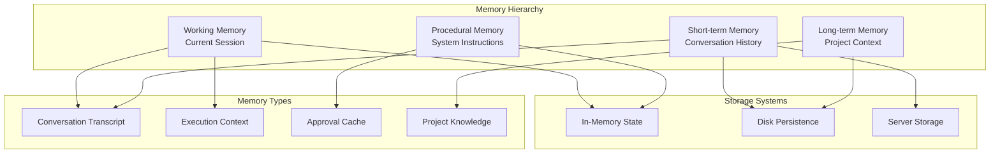

# Memory System Deep Dive

This document provides a comprehensive analysis of Codex's memory and context management systems, exploring how the agent maintains coherent state across interactions and enables sophisticated multi-turn conversations.

## Memory Architecture Overview



## Memory Types and Their Roles

### 1. Working Memory (Session State)

Working memory maintains the active state during execution:

```typescript
class AgentLoop {
  // Conversation state
  private transcript: Message[] = [];
  private responseId?: string;
  
  // Execution state
  private pendingAborts = new Set<string>();
  private cancelController?: CancelController;
  
  // Tool state
  private currentToolCalls: ToolCall[] = [];
  private toolResults: Map<string, ToolResult> = new Map();
  
  // Approval state
  private alwaysApproveCache = new Set<string>();
}
```

**Characteristics**:
- Volatile (lost on process exit)
- Fast access
- Limited capacity
- Task-specific

### 2. Short-term Memory (Conversation History)

Maintains conversation context within and across sessions:

```typescript
interface ConversationMemory {
  // Server-side storage (default)
  previousResponseId?: string;
  
  // Client-side storage (when disabled)
  transcript: Message[];
  
  // Local history file
  historyFile: "~/.codex/history.jsonl";
}
```

**Storage Mechanisms**:

1. **Server-side Storage** (OpenAI):
   ```typescript
   // Efficient - only sends new messages
   messages: [
     ...newMessages,
     { role: "assistant", content: previousResponse }
   ]
   ```

2. **Client-side Storage**:
   ```typescript
   // Complete transcript sent each time
   messages: [...this.transcript, ...newMessages]
   ```

### 3. Long-term Memory (Project Context)

Persistent project-specific knowledge:

```typescript
interface ProjectMemory {
  // Hierarchical context files
  globalContext: "~/.codex/AGENTS.md";
  repoContext: "<repo-root>/AGENTS.md";
  localContext: "<current-dir>/AGENTS.md";
  
  // User instructions
  userInstructions: "~/.codex/instructions.md";
  
  // Size limit to prevent overflow
  maxSize: 32768; // characters
}
```

### 4. Procedural Memory (System Knowledge)

Built-in knowledge about how to operate:

```typescript
const systemKnowledge = {
  // Core instructions
  systemPrompt: "You are an AI assistant with shell access...",
  
  // Model-specific behavior
  modelInstructions: {
    "o1": "Use reasoning for complex tasks",
    "claude": "Follow Anthropic's guidelines",
    "gpt-4": "Standard OpenAI behavior"
  },
  
  // Tool knowledge
  toolDescriptions: [
    { name: "shell", usage: "Execute commands" },
    { name: "apply_patch", usage: "Modify files" }
  ]
};
```

## Memory Persistence Mechanisms

### 1. History File System

Located at `~/.codex/history.jsonl`:

```typescript
interface HistoryEntry {
  session_id: string;      // UUID for session
  timestamp: string;       // ISO 8601 format
  text: string;           // Message content
}

// Example entry:
{
  "session_id": "123e4567-e89b-12d3-a456-426614174000",
  "timestamp": "2024-01-15T10:30:00Z",
  "text": "User: Create a React component"
}
```

**File Locking Implementation**:
```rust
// Rust implementation with retry logic
pub fn append_to_history(entry: &HistoryEntry) -> Result<()> {
    let mut attempts = 0;
    loop {
        match OpenOptions::new()
            .create(true)
            .append(true)
            .open(&history_path)
        {
            Ok(mut file) => {
                file.lock_exclusive()?;
                writeln!(file, "{}", serde_json::to_string(entry)?)?;
                file.unlock()?;
                return Ok(());
            }
            Err(e) if attempts < 10 => {
                attempts += 1;
                thread::sleep(Duration::from_millis(50 * attempts));
            }
            Err(e) => return Err(e.into()),
        }
    }
}
```

### 2. Context Loading Strategy

Contexts are loaded and merged hierarchically:

```typescript
async function loadProjectContext(): Promise<string> {
  const contexts: string[] = [];
  
  // 1. Load global context
  const globalPath = path.join(os.homedir(), '.codex', 'AGENTS.md');
  if (await exists(globalPath)) {
    contexts.push(await readFile(globalPath));
  }
  
  // 2. Find and load repo context
  const repoRoot = await findGitRoot();
  if (repoRoot) {
    const repoPath = path.join(repoRoot, 'AGENTS.md');
    if (await exists(repoPath)) {
      contexts.push(await readFile(repoPath));
    }
  }
  
  // 3. Load local context
  const localPath = path.join(process.cwd(), 'AGENTS.md');
  if (await exists(localPath)) {
    contexts.push(await readFile(localPath));
  }
  
  // 4. Merge and truncate
  const merged = contexts.join('\n\n');
  return merged.slice(0, MAX_CONTEXT_SIZE);
}
```

## Memory Management Strategies

### 1. Context Window Management

Codex uses token estimation to manage context:

```typescript
function estimateTokens(text: string): number {
  // Rough approximation: 4 characters = 1 token
  return Math.ceil(text.length / 4);
}

function buildMessages(transcript: Message[], maxTokens: number): Message[] {
  const messages: Message[] = [];
  let tokenCount = 0;
  
  // Add messages from newest to oldest
  for (let i = transcript.length - 1; i >= 0; i--) {
    const msg = transcript[i];
    const msgTokens = estimateTokens(JSON.stringify(msg));
    
    if (tokenCount + msgTokens > maxTokens) {
      break;
    }
    
    messages.unshift(msg);
    tokenCount += msgTokens;
  }
  
  return messages;
}
```

### 2. Memory Filtering

Not all information is preserved:

```typescript
function filterForContext(message: Message): boolean {
  // Skip system messages
  if (message.role === 'system') return false;
  
  // Skip reasoning traces (for o1 models)
  if (message.reasoning) return false;
  
  // Skip empty messages
  if (!message.content?.trim()) return false;
  
  return true;
}
```

### 3. Conversation Continuity

Maintaining context across tool calls:

```typescript
class ConversationManager {
  async processToolResult(toolCall: ToolCall, result: ToolResult) {
    // Add tool call to conversation
    this.transcript.push({
      role: 'assistant',
      tool_calls: [{
        id: toolCall.id,
        type: 'function',
        function: {
          name: toolCall.name,
          arguments: JSON.stringify(toolCall.arguments)
        }
      }]
    });
    
    // Add tool result
    this.transcript.push({
      role: 'tool',
      tool_call_id: toolCall.id,
      content: result.output
    });
  }
}
```

## Memory Access Patterns

### 1. Sequential Access

For conversation replay:

```typescript
async function* replayConversation(sessionId: string) {
  const history = await loadHistory();
  
  for (const entry of history) {
    if (entry.session_id === sessionId) {
      yield entry;
    }
  }
}
```

### 2. Context Assembly

Building full context for LLM:

```typescript
function assembleContext(): string {
  const parts = [
    this.systemPrompt,           // Procedural memory
    this.projectContext,         // Long-term memory
    this.conversationContext,    // Short-term memory
    this.currentTask             // Working memory
  ];
  
  return parts.filter(Boolean).join('\n\n');
}
```

### 3. Selective Retrieval

For specific information:

```typescript
function findRelevantContext(query: string): string[] {
  const relevant = [];
  
  // Search in project documentation
  if (this.projectDocs.includes(query)) {
    relevant.push(this.projectDocs);
  }
  
  // Search in conversation history
  for (const msg of this.transcript) {
    if (msg.content?.includes(query)) {
      relevant.push(msg.content);
    }
  }
  
  return relevant;
}
```

## Memory Optimization Techniques

### 1. Lazy Loading

Load memory only when needed:

```typescript
class LazyMemoryLoader {
  private cache = new Map<string, Promise<string>>();
  
  async load(key: string): Promise<string> {
    if (!this.cache.has(key)) {
      this.cache.set(key, this.loadFromDisk(key));
    }
    return this.cache.get(key)!;
  }
}
```

### 2. Memory Compression

Reduce memory footprint:

```typescript
interface CompressedMessage {
  role: string;
  content: string;
  // Omit metadata unless necessary
  timestamp?: string;
  metadata?: any;
}

function compressTranscript(messages: Message[]): CompressedMessage[] {
  return messages.map(msg => ({
    role: msg.role,
    content: msg.content,
    // Include metadata only if meaningful
    ...(msg.tool_calls && { tool_calls: msg.tool_calls })
  }));
}
```

### 3. Garbage Collection

Clean up unused memory:

```typescript
class MemoryManager {
  private cleanupInterval = 60000; // 1 minute
  
  startCleanup() {
    setInterval(() => {
      // Clear old approval cache entries
      this.pruneApprovalCache();
      
      // Trim transcript if too large
      if (this.transcript.length > MAX_TRANSCRIPT_SIZE) {
        this.transcript = this.transcript.slice(-KEEP_RECENT);
      }
      
      // Clear tool result cache
      this.toolResults.clear();
    }, this.cleanupInterval);
  }
}
```

## Advanced Memory Features

### 1. Memory Barriers

Preventing information leakage:

```typescript
class IsolatedMemory {
  private contexts = new Map<string, Context>();
  
  createIsolatedContext(id: string): Context {
    const context = new Context();
    this.contexts.set(id, context);
    return context;
  }
  
  // No cross-context access
  getContext(id: string): Context | undefined {
    return this.contexts.get(id);
  }
}
```

### 2. Memory Snapshots

For debugging and recovery:

```typescript
interface MemorySnapshot {
  timestamp: Date;
  transcript: Message[];
  executionState: ExecutionState;
  approvalCache: Set<string>;
}

function createSnapshot(): MemorySnapshot {
  return {
    timestamp: new Date(),
    transcript: [...this.transcript],
    executionState: { ...this.executionState },
    approvalCache: new Set(this.approvalCache)
  };
}
```

### 3. Memory Merge Strategies

For handling conflicts:

```typescript
function mergeContexts(contexts: Context[]): Context {
  const merged = new Context();
  
  // Later contexts override earlier ones
  for (const ctx of contexts) {
    Object.assign(merged.settings, ctx.settings);
    merged.instructions.push(...ctx.instructions);
  }
  
  // Deduplicate instructions
  merged.instructions = [...new Set(merged.instructions)];
  
  return merged;
}
```

## Limitations and Considerations

### Current Limitations

1. **No Semantic Memory**: No embeddings or vector search
2. **Limited Cross-Session Memory**: Each session starts fresh
3. **No Automatic Summarization**: Context can grow large
4. **No Memory Prioritization**: All memories treated equally

### Design Trade-offs

1. **Simplicity vs. Sophistication**:
   - Simple append-only logs
   - No complex indexing
   - Easy to debug and understand

2. **Privacy vs. Functionality**:
   - Server-side storage optional
   - Local history is plain text
   - No cloud dependency

3. **Performance vs. Completeness**:
   - Full transcript can be large
   - No automatic pruning
   - User controls memory scope

## Best Practices for Memory Usage

### 1. Context Design

Structure AGENTS.md effectively:

```markdown
## Project Context
Brief project description and goals

## Technical Stack
- Language: TypeScript
- Framework: React
- Testing: Jest

## Coding Standards
1. Use functional components
2. Implement proper error handling
3. Write comprehensive tests

## Domain Knowledge
Specific business logic and rules
```

### 2. Memory Hygiene

Keep conversations focused:
- Start new sessions for different tasks
- Clear context when switching projects
- Use specific, focused prompts

### 3. Performance Optimization

Manage memory growth:
- Limit context file sizes
- Use `--no-storage` for sensitive data
- Periodically clean history files

## Future Enhancements

### 1. Semantic Memory
```typescript
interface SemanticMemory {
  embeddings: VectorStore;
  
  async store(text: string, metadata: any): Promise<void>;
  async retrieve(query: string, k: number): Promise<Memory[]>;
}
```

### 2. Memory Persistence
```typescript
interface PersistentMemory {
  async saveSession(id: string, state: SessionState): Promise<void>;
  async loadSession(id: string): Promise<SessionState>;
  async listSessions(): Promise<SessionInfo[]>;
}
```

### 3. Intelligent Summarization
```typescript
interface MemorySummarizer {
  async summarize(transcript: Message[]): Promise<Summary>;
  async extractKeyPoints(conversation: Conversation): Promise<KeyPoint[]>;
}
```

The memory system in Codex demonstrates that effective agentic behavior can be achieved with relatively simple memory mechanisms. The hierarchical context system, combined with conversation history and working memory, provides sufficient state management for complex multi-turn interactions while maintaining transparency and user control.