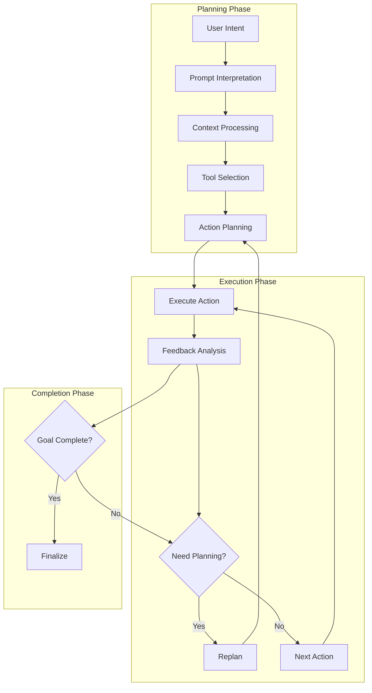
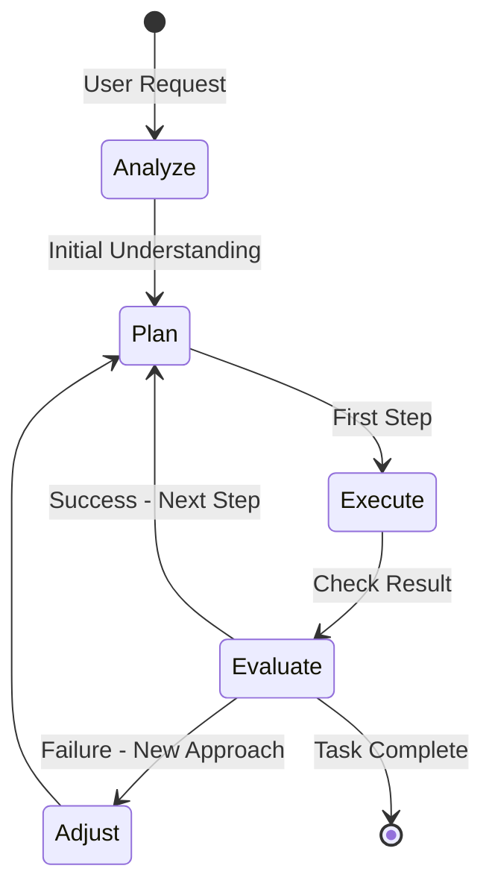
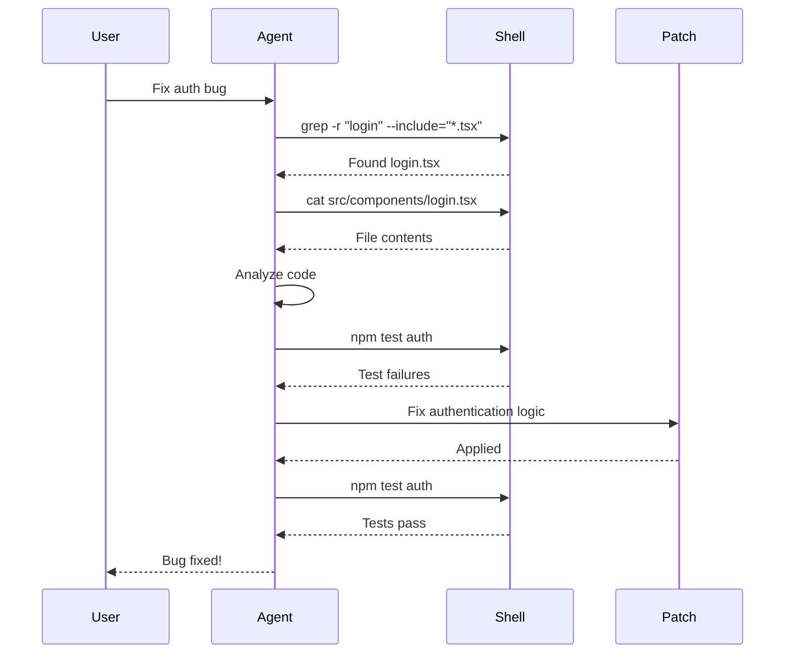
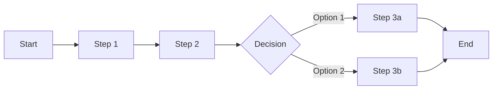

# Planning and Execution Strategies

This document explores how Codex plans and executes complex tasks, examining both the explicit mechanisms and emergent behaviors that enable sophisticated task completion.

## Overview of Planning in Codex

Unlike traditional AI planning systems with explicit goal trees and search algorithms, Codex implements an **emergent planning** approach where sophisticated behavior arises from:

1. **Prompt-guided reasoning**
2. **Iterative execution with feedback**
3. **Context-aware decision making**
4. **Tool-based capability expansion**

## Planning Architecture



## Prompt-Driven Planning

### System Instructions for Planning

The core planning behavior is embedded in the system prompt:

```markdown
You are an AI assistant with shell access...
Your goal is to help the user with any task they need assistance with...
Keep going until the user's query is completely resolved.
```

### Implicit Planning Directives

Key planning instructions include:

1. **Goal Focus**: "achieving the user's goal"
2. **Persistence**: "keep going until completely resolved"
3. **Tool Usage**: "you can use shell to run commands"
4. **Context Awareness**: "understand the directory structure"

## Task Decomposition Strategies

### 1. Natural Language Decomposition

The LLM naturally decomposes tasks through its training:

```typescript
// User: "Set up a new React project with TypeScript and testing"
// Agent decomposes into:
// 1. Create project directory
// 2. Initialize package.json
// 3. Install React and TypeScript
// 4. Configure TypeScript
// 5. Set up testing framework
// 6. Create initial components
```

### 2. Feedback-Driven Decomposition

Each execution provides information for next steps:



### 3. Tool-Guided Decomposition

Available tools shape how tasks are broken down:

```typescript
// Task: "Find and fix all TypeScript errors"
// Decomposition based on tools:
// 1. shell: "npm run typecheck" - Identify errors
// 2. shell: "find . -name '*.ts'" - Locate files
// 3. apply_patch: Fix each error
// 4. shell: "npm run typecheck" - Verify fixes
```

## Execution Patterns

### 1. Linear Execution Pattern

For straightforward tasks:

```typescript
async executeLinear(steps: Step[]) {
  for (const step of steps) {
    const result = await this.executeStep(step);
    if (!result.success) {
      throw new Error(`Step failed: ${step.description}`);
    }
  }
}
```

### 2. Exploratory Execution Pattern

For tasks requiring discovery:

```typescript
async executeExploratory(goal: string) {
  let understanding = await this.explore();
  
  while (!this.isGoalAchieved(goal)) {
    const action = this.decideNextAction(understanding);
    const result = await this.execute(action);
    understanding = this.updateUnderstanding(understanding, result);
  }
}
```

### 3. Iterative Refinement Pattern

For tasks requiring multiple attempts:

```typescript
async executeWithRefinement(task: Task) {
  let attempt = 0;
  let lastError = null;
  
  while (attempt < MAX_ATTEMPTS) {
    try {
      const approach = this.planApproach(task, lastError);
      return await this.execute(approach);
    } catch (error) {
      lastError = error;
      attempt++;
    }
  }
}
```

## Real-World Execution Examples

### Example 1: Bug Fixing Task

**User Request**: "Fix the authentication bug in the login component"

**Execution Flow**:


### Example 2: Project Setup Task

**User Request**: "Create a new Python project with pytest and poetry"

**Planning Breakdown**:
1. Create project structure
2. Initialize poetry
3. Add dependencies
4. Configure pytest
5. Create sample code
6. Run tests

**Execution**:
```typescript
// The agent automatically executes:
await shell("mkdir my-project && cd my-project");
await shell("poetry init -n");
await shell("poetry add --dev pytest pytest-cov");
await applyPatch(createPytestConfig());
await applyPatch(createSampleCode());
await shell("poetry run pytest");
```

## Advanced Planning Features

### 1. Conditional Planning

The agent adapts based on conditions:

```typescript
// Implicit in LLM reasoning:
if (fileExists("package.json")) {
  // Node.js project actions
} else if (fileExists("Cargo.toml")) {
  // Rust project actions
} else {
  // Generic actions
}
```

### 2. Error Recovery Planning

Built-in error handling enables replanning:

```typescript
try {
  await executeAction(action);
} catch (error) {
  // LLM sees error and replans
  const recovery = await planRecovery(error);
  await executeAction(recovery);
}
```

### 3. Resource-Aware Planning

The agent considers available resources:

- Available tools
- File system state
- Execution permissions
- Network access (sandboxed mode)

## Planning Strategies by Task Type

### 1. Code Generation Tasks

**Strategy**: Template-based planning
```
1. Understand requirements
2. Check existing code patterns
3. Generate new code following patterns
4. Integrate with existing code
5. Test the implementation
```

### 2. Debugging Tasks

**Strategy**: Diagnostic planning
```
1. Reproduce the issue
2. Gather diagnostic information
3. Form hypotheses
4. Test hypotheses
5. Implement fix
6. Verify fix
```

### 3. Refactoring Tasks

**Strategy**: Incremental planning
```
1. Identify refactoring targets
2. Plan refactoring steps
3. Make changes incrementally
4. Run tests after each change
5. Update documentation
```

### 4. Analysis Tasks

**Strategy**: Information gathering
```
1. Define information needs
2. Search relevant files
3. Extract data
4. Analyze patterns
5. Summarize findings
```

## Execution Optimizations

### 1. Parallel Execution

When possible, execute independent tasks in parallel:

```typescript
// Conceptual - actual implementation varies
const results = await Promise.all([
  shell("npm install"),
  shell("pip install -r requirements.txt"),
  checkFileStructure()
]);
```

### 2. Caching and Reuse

Previous execution results inform future planning:

```typescript
class ExecutionCache {
  private results = new Map<string, any>();
  
  async execute(command: string) {
    if (this.results.has(command)) {
      return this.results.get(command);
    }
    const result = await shell(command);
    this.results.set(command, result);
    return result;
  }
}
```

### 3. Early Termination

Stop execution when goal is achieved:

```typescript
while (!goalAchieved && attempts < maxAttempts) {
  const result = await executeNextStep();
  if (isSuccessful(result)) {
    goalAchieved = true;
  }
  attempts++;
}
```

## Emergent Planning Behaviors

### 1. Learning from Feedback

The agent adjusts strategies based on results:
- Failed commands lead to alternative approaches
- Error messages guide debugging
- File contents inform next actions

### 2. Context-Sensitive Planning

Plans adapt to discovered context:
- Project type detection
- Framework identification
- Dependency analysis

### 3. Goal-Oriented Persistence

The agent persists until success:
- Retries with modifications
- Seeks alternative solutions
- Asks for clarification when stuck

## Best Practices for Effective Planning

### 1. Clear Goal Definition

Provide specific, measurable goals:
```
❌ "Make the code better"
✅ "Refactor the auth module to use dependency injection"
```

### 2. Context Provision

Include relevant context in AGENTS.md:
```markdown
## Project Structure
- Frontend: React with TypeScript
- Backend: Node.js with Express
- Database: PostgreSQL

## Coding Standards
- Use functional components
- Implement error boundaries
- Write tests for all features
```

### 3. Tool Configuration

Ensure necessary tools are available:
```json
{
  "mcpServers": {
    "database": {
      "command": "mcp-server-postgres",
      "args": ["--connection-string", "..."]
    }
  }
}
```

## Limitations and Mitigations

### Current Limitations

1. **No explicit goal representation**: Goals exist only in prompts
2. **No plan persistence**: Plans are implicit in conversation
3. **Limited backtracking**: Can't undo complex operations
4. **No cost optimization**: Doesn't minimize tool calls

### Mitigation Strategies

1. **Clear instructions**: Compensate with detailed prompts
2. **Incremental execution**: Small, reversible steps
3. **Verification steps**: Check results frequently
4. **Manual checkpoints**: Save state at key points

## Future Directions

Potential enhancements for planning:

1. **Explicit Plan Representation**
```typescript
interface Plan {
  goal: string;
  steps: Step[];
  dependencies: Dependency[];
  checkpoints: Checkpoint[];
}
```

2. **Plan Visualization**


3. **Plan Learning**
- Save successful plans
- Reuse for similar tasks
- Adapt based on outcomes

The current planning and execution system in Codex demonstrates that sophisticated task completion can emerge from simple primitives (loops, tools, prompts) combined with powerful language models. This approach provides flexibility and adaptability while maintaining comprehensibility and control.