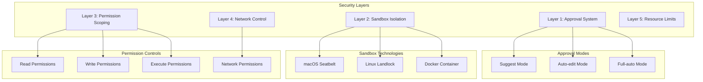
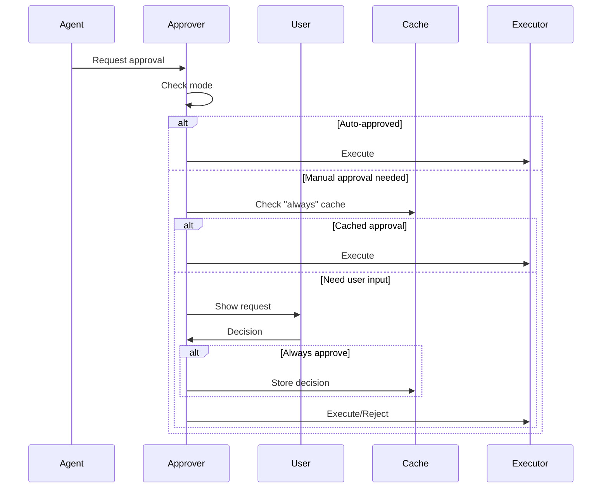
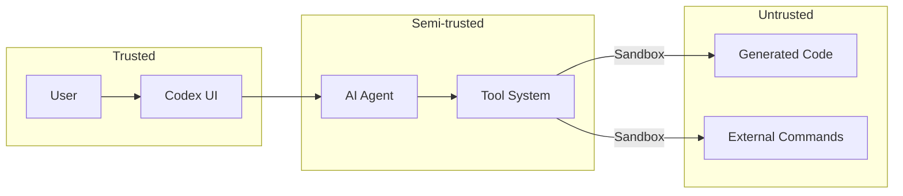

# Security Model

Codex implements a comprehensive security model designed to safely execute AI-generated code while maintaining user control. This document details the multi-layered security architecture.

## Security Architecture Overview



## Layer 1: Approval System

### Approval Modes

Codex provides three approval modes with increasing levels of automation:

#### 1. Suggest Mode (Default)
```typescript
{
  autoApprove: (command: string) => {
    // Only auto-approve known-safe read operations
    const safeCommands = ['ls', 'pwd', 'cat', 'echo', 'which'];
    return safeCommands.some(cmd => command.startsWith(cmd));
  }
}
```

**Characteristics**:
- Manual approval for all modifications
- Auto-approval only for read operations
- Maximum user control
- Suitable for untrusted contexts

#### 2. Auto-edit Mode
```typescript
{
  autoApprove: (operation: Operation) => {
    if (operation.type === 'file_edit') {
      // Auto-approve file edits within project
      return isWithinProject(operation.path);
    }
    // Still require approval for commands
    return false;
  }
}
```

**Characteristics**:
- Auto-approve file modifications
- Manual approval for shell commands
- Balanced automation
- Good for trusted projects

#### 3. Full-auto Mode
```typescript
{
  autoApprove: () => true,  // Approve everything
  sandbox: 'always'         // But always sandboxed
}
```

**Characteristics**:
- All operations auto-approved
- Mandatory sandboxing
- Network isolated by default
- Maximum automation with safety

### Approval Flow



## Layer 2: Sandbox Isolation

### macOS Seatbelt Implementation

Codex uses Apple's Seatbelt (sandbox-exec) for process isolation:

```scheme
;; Seatbelt policy for Codex
(version 1)
(deny default)

;; Allow process execution
(allow process-exec)
(allow process-fork)

;; Allow reading everywhere
(allow file-read*)

;; Restrict writing to working directory
(allow file-write*
    (subpath "/Users/developer/project"))

;; Network restrictions
(deny network*)  ; In full-auto mode

;; System operations
(allow signal (target self))
(allow system-socket)
```

**Enforcement**:
```rust
pub fn run_sandboxed(command: &str, policy: &str) -> Result<Output> {
    Command::new("sandbox-exec")
        .arg("-p")
        .arg(policy)
        .arg("sh")
        .arg("-c")
        .arg(command)
        .output()
}
```

### Linux Landlock Implementation

For Linux systems, Landlock provides filesystem isolation:

```rust
use landlock::{
    Access, AccessFs, Ruleset, RulesetCreated,
    ABI, PathBeneath, PathFd,
};

fn create_sandbox() -> Result<RulesetCreated> {
    let abi = ABI::V3;
    
    Ruleset::new()
        .handle_access(AccessFs::from_all(abi))?
        .create()?
        // Read access everywhere
        .add_rule(PathBeneath::new(
            PathFd::new("/")?,
            AccessFs::READ_FILE | AccessFs::READ_DIR,
        ))?
        // Write access only to working directory
        .add_rule(PathBeneath::new(
            PathFd::new("/home/user/project")?,
            AccessFs::from_all(abi),
        ))?
        .restrict_self()
}
```

### Docker Container Option

For maximum isolation:

```dockerfile
FROM alpine:latest
RUN apk add --no-cache bash coreutils
WORKDIR /workspace
USER nobody
```

```typescript
const dockerSandbox = {
  image: 'codex-sandbox',
  volumes: [`${workDir}:/workspace:rw`],
  network: 'none',  // No network in full-auto
  memory: '1g',
  cpus: '1.0'
};
```

## Layer 3: Permission Scoping

### File System Permissions

```typescript
interface FilePermissions {
  // Scoped write permissions
  writeAllowed: (path: string) => {
    const allowed = [
      process.cwd(),           // Current directory
      '/tmp',                  // Temporary files
      os.homedir() + '/.cache' // Cache directory
    ];
    
    return allowed.some(dir => 
      path.startsWith(path.resolve(dir))
    );
  },
  
  // Unrestricted read (except sensitive)
  readAllowed: (path: string) => {
    const forbidden = [
      '~/.ssh',
      '~/.gnupg',
      '~/.aws',
      '/etc/shadow'
    ];
    
    return !forbidden.some(dir => 
      path.includes(dir)
    );
  }
}
```

### Command Filtering

```typescript
class CommandFilter {
  private dangerous = [
    'rm -rf /',
    'dd if=/dev/zero',
    'fork bomb patterns',
    ':(){ :|:& };:',
    'sudo',
    'su -'
  ];
  
  isSafe(command: string): boolean {
    return !this.dangerous.some(pattern => 
      command.includes(pattern)
    );
  }
  
  sanitize(command: string): string {
    // Remove potentially dangerous constructs
    return command
      .replace(/;\s*rm\s+-rf\s+\//, '')
      .replace(/\$\(.*\)/, '')  // Command substitution
      .replace(/`.*`/, '');      // Backticks
  }
}
```

## Layer 4: Network Control

### Network Isolation Modes

```typescript
enum NetworkMode {
  ALLOW = 'allow',      // Normal network access
  LOCAL = 'local',      // Local connections only
  NONE = 'none'         // Complete isolation
}

interface NetworkPolicy {
  mode: NetworkMode;
  allowedHosts?: string[];
  allowedPorts?: number[];
}
```

### Implementation

**macOS Seatbelt**:
```scheme
;; Network rules based on mode
(if (equal? network-mode "none")
    (deny network*)
    (if (equal? network-mode "local")
        (allow network* (remote ip "localhost:*"))
        (allow network*)))
```

**Linux iptables**:
```bash
# Complete network isolation
iptables -I OUTPUT -m owner --uid-owner sandbox -j DROP

# Local only
iptables -I OUTPUT -m owner --uid-owner sandbox ! -d 127.0.0.1 -j DROP
```

## Layer 5: Resource Limits

### Process Limits

```typescript
interface ResourceLimits {
  cpu: {
    percent: 80,        // Max CPU usage
    timeout: 300000     // 5 minute timeout
  },
  memory: {
    max: '1GB',         // Max memory
    swap: '0'           // No swap
  },
  disk: {
    quota: '100MB',     // Write quota
    temp: '1GB'         // Temp space
  },
  processes: {
    max: 50,            // Max child processes
    threads: 100        // Max threads
  }
}
```

### Implementation

**Using systemd-run (Linux)**:
```bash
systemd-run \
  --uid=sandbox \
  --property=MemoryMax=1G \
  --property=CPUQuota=80% \
  --property=TasksMax=50 \
  --pipe \
  -- command
```

**Using ulimit**:
```bash
ulimit -v 1048576  # 1GB virtual memory
ulimit -t 300      # 300s CPU time
ulimit -u 50       # 50 processes
ulimit -n 1024     # 1024 file descriptors
```

## Security Policies

### Default Security Policy

```typescript
const defaultPolicy: SecurityPolicy = {
  approval: {
    mode: 'suggest',
    cache: true,
    timeout: 30000
  },
  sandbox: {
    enabled: true,
    mode: 'auto',  // Based on approval mode
    technology: process.platform === 'darwin' ? 'seatbelt' : 'landlock'
  },
  permissions: {
    read: { allowed: ['**/*'], denied: ['~/.ssh/**'] },
    write: { allowed: ['./**'], denied: ['/**'] },
    execute: { allowed: true },
    network: { mode: 'allow' }
  },
  resources: {
    cpu: { percent: 80 },
    memory: { max: '1GB' },
    timeout: 300000
  }
};
```

### Full-auto Security Policy

```typescript
const fullAutoPolicy: SecurityPolicy = {
  ...defaultPolicy,
  approval: {
    mode: 'full-auto',
    cache: false,  // No caching needed
    timeout: 0
  },
  sandbox: {
    enabled: true,
    mode: 'strict',
    technology: 'docker'  // Prefer container
  },
  permissions: {
    ...defaultPolicy.permissions,
    network: { mode: 'none' }  // No network
  }
};
```

## Threat Model

### Threats Addressed

1. **Malicious Code Execution**
   - Mitigated by: Sandboxing, approval system
   - Residual risk: Approved operations

2. **Data Exfiltration**
   - Mitigated by: Network isolation, permission scoping
   - Residual risk: Local file access

3. **System Compromise**
   - Mitigated by: Process isolation, resource limits
   - Residual risk: Sandbox escapes

4. **Prompt Injection**
   - Mitigated by: User approval, clear UI
   - Residual risk: Social engineering

### Security Boundaries



## Best Practices

### 1. Principle of Least Privilege

Always use the minimum necessary permissions:

```typescript
// Good: Specific permissions
const permissions = {
  write: { allowed: ['./src/**', './tests/**'] }
};

// Bad: Overly broad permissions
const permissions = {
  write: { allowed: ['/**'] }
};
```

### 2. Defense in Depth

Layer multiple security controls:

1. User approval (human judgment)
2. Sandboxing (technical control)
3. Permission scoping (minimize damage)
4. Resource limits (prevent DoS)

### 3. Secure Defaults

Default to the most secure configuration:

- Suggest mode by default
- Sandboxing enabled
- Network isolation in full-auto
- Conservative resource limits

### 4. Transparency

Make security visible:

```typescript
function showSecurityInfo(operation: Operation) {
  console.log(`🔒 Security: ${operation.sandbox ? 'Sandboxed' : 'Direct'}`);
  console.log(`📁 Write access: ${operation.writeScope}`);
  console.log(`🌐 Network: ${operation.networkMode}`);
}
```

## Audit and Monitoring

### Security Events

```typescript
interface SecurityEvent {
  timestamp: Date;
  type: 'approval' | 'sandbox' | 'violation';
  operation: string;
  decision: 'allow' | 'deny';
  reason?: string;
}

class SecurityAuditor {
  log(event: SecurityEvent) {
    // Log to ~/.codex/security.log
    const entry = JSON.stringify(event);
    fs.appendFileSync(this.logPath, entry + '\n');
  }
}
```

### Monitoring Metrics

- Approval rates by mode
- Sandbox violations
- Resource limit hits
- Network access attempts

## Future Enhancements

### 1. Capability-Based Security

```typescript
interface Capability {
  id: string;
  permissions: Permission[];
  expiry?: Date;
  uses?: number;
}
```

### 2. Behavioral Analysis

```typescript
class BehaviorMonitor {
  async detectAnomalies(operations: Operation[]): Promise<Anomaly[]> {
    // Detect unusual patterns
    // Rate of operations
    // Unusual file access
    // Network patterns
  }
}
```

### 3. Zero-Trust Architecture

- Verify every operation
- No implicit trust
- Continuous validation
- Minimal persistence

The security model in Codex demonstrates that AI-powered development tools can be both powerful and safe through careful design and defense-in-depth strategies. The multi-layered approach ensures that even if one security control fails, others provide protection.