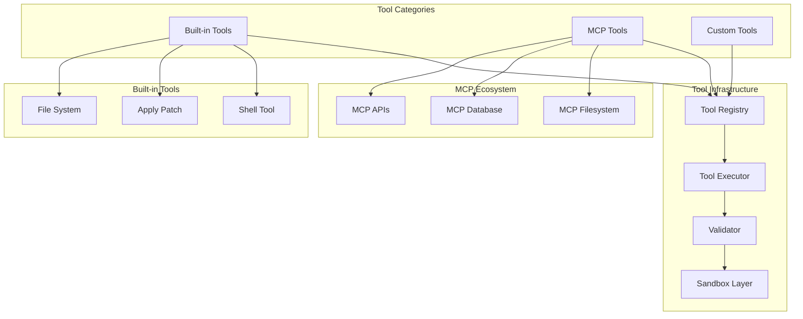
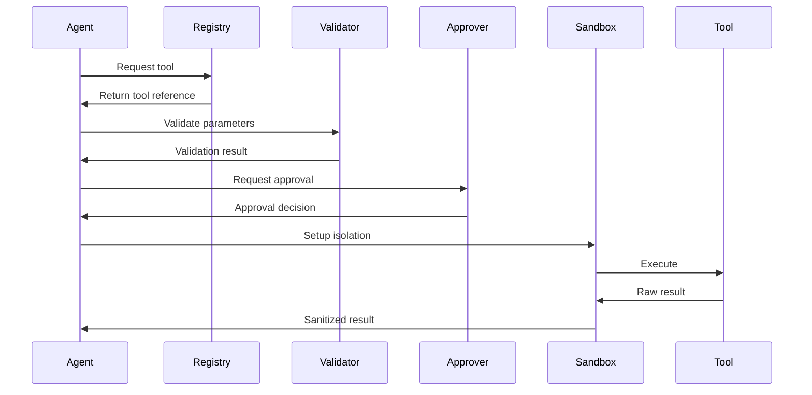

# Tool System Architecture

The tool system is a fundamental component of Codex's agentic capabilities, enabling the AI to interact with external systems and perform concrete actions. This document provides a comprehensive overview of the tool architecture.

## Tool System Overview



## Built-in Tools

### 1. Shell Tool

The primary tool for system interaction:

```typescript
interface ShellTool {
  name: "shell";
  description: "Execute shell commands";
  parameters: {
    type: "object";
    properties: {
      command: {
        type: "string";
        description: "The shell command to execute";
      };
      wait_for_seconds: {
        type: "number";
        description: "Optional delay after execution";
      };
    };
    required: ["command"];
  };
}
```

**Implementation Details**:
```typescript
class ShellExecutor {
  async execute(params: ShellParams): Promise<ShellResult> {
    // 1. Validate command
    if (!this.validator.isSafe(params.command)) {
      throw new Error("Unsafe command");
    }
    
    // 2. Check approval
    const approved = await this.approver.check(params.command);
    if (!approved) {
      throw new Error("Command not approved");
    }
    
    // 3. Execute in sandbox
    const result = await this.sandbox.exec(params.command, {
      cwd: this.workingDirectory,
      timeout: 300000,  // 5 minutes
      env: this.environment
    });
    
    // 4. Format output
    return {
      exitCode: result.exitCode,
      stdout: result.stdout,
      stderr: result.stderr,
      duration: result.duration
    };
  }
}
```

### 2. Apply Patch Tool

Safe code modification tool:

```typescript
interface ApplyPatchTool {
  name: "apply_patch";
  description: "Apply code modifications using a specialized patch format";
  parameters: {
    type: "object";
    properties: {
      patch: {
        type: "string";
        description: "The patch content in Codex patch format";
      };
    };
    required: ["patch"];
  };
}
```

**Patch Format**:
```
<<<<<<< ORIGINAL
function oldCode() {
  return 42;
}
=======
function newCode() {
  return 43;
}
>>>>>>> MODIFIED
```

**Implementation**:
```typescript
class PatchApplier {
  async apply(patch: string): Promise<PatchResult> {
    const operations = this.parsePatch(patch);
    const results = [];
    
    for (const op of operations) {
      // 1. Read file
      const content = await fs.readFile(op.file, 'utf8');
      
      // 2. Find match (with fuzzy matching)
      const match = this.findMatch(content, op.original);
      if (!match) {
        throw new Error(`Could not find match in ${op.file}`);
      }
      
      // 3. Apply change
      const newContent = this.applyChange(content, match, op.modified);
      
      // 4. Write file
      await fs.writeFile(op.file, newContent);
      
      results.push({
        file: op.file,
        status: 'success',
        changes: match.lines
      });
    }
    
    return { results };
  }
}
```

## MCP (Model Context Protocol) Tools

### Overview

MCP enables integration with external services:

```typescript
interface MCPServer {
  name: string;
  command: string;
  args: string[];
  env?: Record<string, string>;
}

interface MCPTool {
  name: string;
  description: string;
  inputSchema: JSONSchema;
  handler: (input: any) => Promise<any>;
}
```

### Configuration

In `~/.codex/config.json`:
```json
{
  "mcpServers": {
    "filesystem": {
      "command": "npx",
      "args": ["@modelcontextprotocol/server-filesystem", "/allowed/path"]
    },
    "postgres": {
      "command": "mcp-postgres",
      "args": ["--connection", "postgresql://localhost/db"],
      "env": {
        "PGPASSWORD": "secret"
      }
    },
    "github": {
      "command": "mcp-github",
      "args": ["--token", "${GITHUB_TOKEN}"]
    }
  }
}
```

### MCP Communication

```typescript
class MCPClient {
  private process: ChildProcess;
  private rpc: JSONRPCClient;
  
  async connect(server: MCPServer): Promise<void> {
    // 1. Spawn server process
    this.process = spawn(server.command, server.args, {
      env: { ...process.env, ...server.env }
    });
    
    // 2. Setup JSON-RPC communication
    this.rpc = new JSONRPCClient(
      this.process.stdout,
      this.process.stdin
    );
    
    // 3. Initialize connection
    await this.rpc.call('initialize', {
      protocolVersion: '0.1.0',
      capabilities: {}
    });
  }
  
  async listTools(): Promise<MCPTool[]> {
    const response = await this.rpc.call('tools/list');
    return response.tools;
  }
  
  async callTool(name: string, arguments: any): Promise<any> {
    return await this.rpc.call('tools/call', {
      name,
      arguments
    });
  }
}
```

## Tool Registry and Discovery

### Tool Registration

```typescript
class ToolRegistry {
  private tools = new Map<string, Tool>();
  
  register(tool: Tool): void {
    // Validate tool schema
    this.validateTool(tool);
    
    // Check for conflicts
    if (this.tools.has(tool.name)) {
      throw new Error(`Tool ${tool.name} already registered`);
    }
    
    // Register
    this.tools.set(tool.name, tool);
  }
  
  async discoverMCPTools(): Promise<void> {
    for (const [name, config] of Object.entries(this.mcpServers)) {
      const client = new MCPClient();
      await client.connect(config);
      
      const tools = await client.listTools();
      for (const tool of tools) {
        this.register({
          name: `${name}.${tool.name}`,
          description: tool.description,
          parameters: tool.inputSchema,
          execute: (params) => client.callTool(tool.name, params)
        });
      }
    }
  }
}
```

### Tool Resolution

```typescript
class ToolResolver {
  resolve(name: string): Tool | undefined {
    // 1. Check built-in tools
    const builtin = this.builtinTools.get(name);
    if (builtin) return builtin;
    
    // 2. Check MCP tools
    const mcp = this.mcpTools.get(name);
    if (mcp) return mcp;
    
    // 3. Check custom tools
    const custom = this.customTools.get(name);
    if (custom) return custom;
    
    return undefined;
  }
  
  // Fuzzy matching for similar tool names
  suggest(name: string): string[] {
    const allTools = [
      ...this.builtinTools.keys(),
      ...this.mcpTools.keys(),
      ...this.customTools.keys()
    ];
    
    return allTools
      .map(tool => ({
        tool,
        score: this.similarity(name, tool)
      }))
      .filter(({ score }) => score > 0.7)
      .sort((a, b) => b.score - a.score)
      .map(({ tool }) => tool);
  }
}
```

## Tool Execution Pipeline

### Execution Flow



### Implementation

```typescript
class ToolExecutor {
  async execute(
    toolName: string,
    parameters: any
  ): Promise<ToolResult> {
    // 1. Resolve tool
    const tool = this.registry.resolve(toolName);
    if (!tool) {
      throw new Error(`Unknown tool: ${toolName}`);
    }
    
    // 2. Validate parameters
    const validation = this.validator.validate(
      parameters,
      tool.parameters
    );
    if (!validation.valid) {
      throw new Error(`Invalid parameters: ${validation.errors}`);
    }
    
    // 3. Check approval
    const approved = await this.approver.checkTool(
      tool,
      parameters
    );
    if (!approved) {
      return {
        status: 'rejected',
        reason: 'User rejected execution'
      };
    }
    
    // 4. Setup execution context
    const context = {
      workingDirectory: this.cwd,
      environment: this.env,
      timeout: tool.timeout || 300000,
      sandbox: this.getSandboxPolicy(tool)
    };
    
    // 5. Execute in sandbox
    try {
      const result = await this.sandbox.execute(
        () => tool.execute(parameters),
        context
      );
      
      return {
        status: 'success',
        output: result
      };
    } catch (error) {
      return {
        status: 'error',
        error: error.message,
        stack: error.stack
      };
    }
  }
}
```

## Custom Tool Development

### Tool Interface

```typescript
interface CustomTool {
  name: string;
  description: string;
  parameters: JSONSchema;
  execute: (params: any) => Promise<any>;
  
  // Optional configurations
  timeout?: number;
  requiresApproval?: boolean;
  sandboxPolicy?: SandboxPolicy;
  retryable?: boolean;
}
```

### Example Custom Tool

```typescript
const gitTool: CustomTool = {
  name: "git_operations",
  description: "Perform git operations safely",
  parameters: {
    type: "object",
    properties: {
      operation: {
        type: "string",
        enum: ["status", "add", "commit", "push", "pull"],
        description: "Git operation to perform"
      },
      args: {
        type: "array",
        items: { type: "string" },
        description: "Additional arguments"
      }
    },
    required: ["operation"]
  },
  
  execute: async (params) => {
    const { operation, args = [] } = params;
    
    // Safety checks
    if (operation === "push" && !params.confirmed) {
      throw new Error("Push operations require confirmation");
    }
    
    // Execute git command
    const result = await exec(`git ${operation} ${args.join(' ')}`);
    
    // Parse and return structured output
    return {
      operation,
      output: result.stdout,
      status: result.exitCode === 0 ? 'success' : 'failed'
    };
  },
  
  requiresApproval: true,
  timeout: 30000
};
```

### Registering Custom Tools

```typescript
// In a plugin file
export function registerTools(registry: ToolRegistry) {
  registry.register(gitTool);
  registry.register(dockerTool);
  registry.register(databaseTool);
}

// In Codex configuration
{
  "plugins": [
    "./my-custom-tools.js"
  ]
}
```

## Tool Safety and Validation

### Parameter Validation

```typescript
class ToolValidator {
  validate(params: any, schema: JSONSchema): ValidationResult {
    // 1. Type validation
    const ajv = new Ajv();
    const valid = ajv.validate(schema, params);
    
    if (!valid) {
      return {
        valid: false,
        errors: ajv.errors
      };
    }
    
    // 2. Semantic validation
    const semanticErrors = this.validateSemantics(params, schema);
    if (semanticErrors.length > 0) {
      return {
        valid: false,
        errors: semanticErrors
      };
    }
    
    // 3. Security validation
    const securityIssues = this.validateSecurity(params);
    if (securityIssues.length > 0) {
      return {
        valid: false,
        errors: securityIssues
      };
    }
    
    return { valid: true };
  }
  
  private validateSecurity(params: any): string[] {
    const issues = [];
    
    // Check for injection attempts
    if (this.containsInjection(params)) {
      issues.push("Potential injection detected");
    }
    
    // Check for path traversal
    if (this.containsPathTraversal(params)) {
      issues.push("Path traversal detected");
    }
    
    // Check for sensitive data
    if (this.containsSensitiveData(params)) {
      issues.push("Sensitive data detected");
    }
    
    return issues;
  }
}
```

### Sandbox Policies

```typescript
interface SandboxPolicy {
  filesystem: {
    read: string[];   // Allowed read paths
    write: string[];  // Allowed write paths
  };
  network: {
    allowed: boolean;
    hosts?: string[]; // Allowed hosts if network enabled
  };
  process: {
    spawn: boolean;   // Can spawn child processes
  };
  resources: {
    memory: string;   // Memory limit
    cpu: number;      // CPU percentage
    timeout: number;  // Execution timeout
  };
}

// Example policies
const strictPolicy: SandboxPolicy = {
  filesystem: {
    read: ["./"],
    write: ["./output"]
  },
  network: { allowed: false },
  process: { spawn: false },
  resources: {
    memory: "512MB",
    cpu: 50,
    timeout: 30000
  }
};
```

## Tool Composition Patterns

### Sequential Composition

```typescript
// Agent composing tools sequentially
async function deployApplication() {
  // 1. Run tests
  await tool("shell", { command: "npm test" });
  
  // 2. Build application
  await tool("shell", { command: "npm run build" });
  
  // 3. Deploy
  await tool("deploy", { 
    target: "production",
    version: "latest"
  });
  
  // 4. Verify deployment
  await tool("health_check", {
    url: "https://app.example.com"
  });
}
```

### Parallel Composition

```typescript
// Agent running tools in parallel
async function analyzeCodebase() {
  const results = await Promise.all([
    tool("lint", { path: "./src" }),
    tool("test_coverage", { verbose: true }),
    tool("security_scan", { deep: true }),
    tool("dependency_check", {})
  ]);
  
  return summarizeResults(results);
}
```

### Conditional Composition

```typescript
// Agent using conditional logic
async function smartDeploy() {
  const tests = await tool("shell", { command: "npm test" });
  
  if (tests.exitCode !== 0) {
    // Fix tests first
    await tool("fix_tests", { auto: true });
    // Retry
    await tool("shell", { command: "npm test" });
  }
  
  await tool("deploy", { target: "staging" });
}
```

## Best Practices

### 1. Tool Design Principles

- **Single Responsibility**: Each tool should do one thing well
- **Descriptive Names**: Use clear, action-oriented names
- **Rich Descriptions**: Help the LLM understand when to use the tool
- **Comprehensive Parameters**: Define all parameters with descriptions
- **Predictable Output**: Return consistent, structured results

### 2. Error Handling

```typescript
class RobustTool {
  async execute(params: any): Promise<ToolResult> {
    try {
      const result = await this.doExecute(params);
      return { status: 'success', data: result };
    } catch (error) {
      // Categorize errors
      if (error.code === 'ENOENT') {
        return {
          status: 'error',
          error: 'file_not_found',
          message: `File not found: ${error.path}`,
          recoverable: true
        };
      }
      
      // Unknown errors
      return {
        status: 'error',
        error: 'unknown',
        message: error.message,
        stack: error.stack,
        recoverable: false
      };
    }
  }
}
```

### 3. Tool Documentation

```typescript
const wellDocumentedTool = {
  name: "analyze_code",
  description: `Analyze code for quality issues, security vulnerabilities, 
                and style violations. Returns structured report with 
                severity levels and fix suggestions.`,
  
  parameters: {
    type: "object",
    properties: {
      path: {
        type: "string",
        description: "Path to file or directory to analyze"
      },
      checks: {
        type: "array",
        items: {
          type: "string",
          enum: ["lint", "security", "complexity", "style"]
        },
        description: "Types of checks to perform",
        default: ["lint", "security"]
      },
      fix: {
        type: "boolean",
        description: "Attempt to auto-fix issues",
        default: false
      }
    },
    required: ["path"]
  },
  
  examples: [
    {
      input: { path: "./src", checks: ["lint"] },
      output: { issues: 5, fixed: 0, report: "..." }
    }
  ]
};
```

The tool system is the bridge between the AI's intelligence and real-world actions. By providing a robust, safe, and extensible tool architecture, Codex enables sophisticated agentic behaviors while maintaining security and user control.